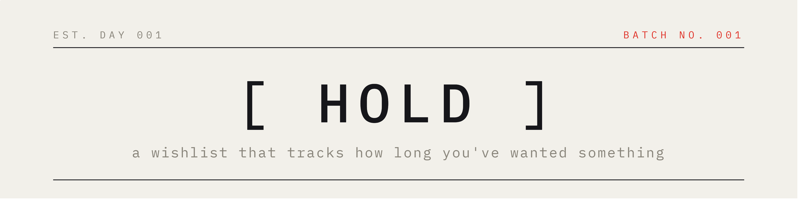

save an item, set how long you'll wait. the app counts. when the wait is up, the item turns red and rises to the top. until then, it stays quiet.

live at [hold.nourin.me](https://hold.nourin.me) · [see an example list](https://hold.nourin.me/s/demo)

**✦ what it does**

- paste a product link and it reads the page: title, brand, image, price, no manual entry needed
- set a wait, from a day to a year, and watch the countdown instead of the item
- ready items surface in red, sorted above everything still waiting
- budgets and totals per list, grouped by currency.
- save things with no link at all: diy projects, or something you have not found yet
- prices you guessed are marked as estimates, never mixed up with what a shop quoted
- re-check a price on demand to see whether it moved while you waited
- your own page: what you held, what you let go, and the money you did not spend
- share a list read-only with a link, no account needed on the other end
- sign in with google, nothing else to remember

**✦ stack**

.net 10 · blazor server · ef core · postgresql · anglesharp · claude api
